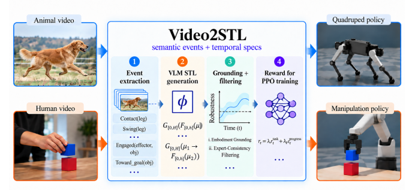

<h1>Video2STL: Grounding VLM-Generated Temporal Specifications for Robot Learning</h1>

  <a href="#">[Github repo]</a> &nbsp;&nbsp;|&nbsp;&nbsp;
  <a href="https://arxiv.org/pdf/2609.37519">[Paper]</a> 

## Abstract

Video-based policy learning is particularly promising because it illustrates target behaviors without requiring action annotations or embodiment-matched demonstrations. A central challenge is deciding what information should be transferred from the video to the robot, as existing approaches often make the temporal structure of a task difficult to inspect, ground, and reuse. We present Video2STL, a framework that converts observation-only videos into parametric Signal Temporal Logic (STL) specifications and uses the resulting formal representation for robot learning. A vision-language model first extracts an embodiment-independent semantic event trace and then constructs a bank of symbolic temporal specifications. The model determines the task structure, while numerical predicate thresholds and temporal bounds are grounded from successful robot trajectories. For policy learning, short-horizon specifications provide dense rewards through rolling-window quantitative robustness, while a causal monitor over a retained long-horizon specification provides one-time progress rewards for valid temporal prefixes. Across four manipulation tasks, Video2STL achieves 85.8% average success-once and 67.0% success-at-end, compared with 81.5%/59.5% for native dense PPO and 65.0%/42.3% for Text2Reward. In quadruped locomotion, Qwen-3.8 and GPT-5.6-based Video2STL policies achieve 100% success across velocities from 0.3 to 2.1 m/s while remaining competitive in high-speed energy efficiency. 

 

 

## Methodology

Our framework separates symbolic task inference from embodiment-specific grounding. The pipeline consists of four main stages:

### 1. Event Extraction
* A vision-language model (VLM) maps an observation-only video to an embodiment-independent semantic event trace. 
* The trace uses a global ontology to define task-relevant events and pairwise temporal relations without relying on robot-specific metrics.

### 2. VLM STL Generation
* A second VLM stage translates the semantic trace into a bank of parametric STL formulas. 
* At this stage, numerical predicate thresholds and time constants are forbidden; only symbolic parameters are allowed.

### 3. Target-Embodiment Grounding & Expert-Consistency Filtering
* Successful robot trajectories are split into a grounding set and a held-out filtering set. 
* The grounding set is used to fit embodiment-specific numerical parameters and temporal bounds using empirical quantiles. 
* The held-out filtering set is used to evaluate each formula, ensuring that only specifications compatible with successful target-embodiment behaviors are retained.

### 4. Two-Timescale Temporal Reward
* **Short-horizon specifications:** Evaluated on a trailing window to provide dense, local policy feedback via smooth robustness.
* **Long-horizon specifications:** Monitored causally, yielding a one-time sparse progress reward when a new valid stage of the temporal sequence is reached without violating required order or deadlines.

## Experimental Results

### Quadruped Locomotion
Evaluated on Google's Barkour vb quadruped in MuJoCo XLA (MJX) across a range of commanded forward velocities. Policies are evaluated using 20 independent rollouts of 500 simulation steps. Survival and velocity-tracking success are reported as percentages (higher is better), and CoT denotes cost of transportation (lower is better).

<table>
  <thead>
    <tr>
      <th rowspan="2">vx (m/s)</th>
      <th colspan="3" align="center">Video2STL (GPT-5.6)</th>
      <th colspan="3" align="center">Video2STL (Qwen 3.8)</th>
      <th colspan="3" align="center">Text2Reward</th>
      <th colspan="3" align="center">Heuristic</th>
    </tr>
    <tr>
      <th align="center">Surv. &uarr;</th><th align="center">Succ. &uarr;</th><th align="center">CoT &darr;</th>
      <th align="center">Surv. &uarr;</th><th align="center">Succ. &uarr;</th><th align="center">CoT &darr;</th>
      <th align="center">Surv. &uarr;</th><th align="center">Succ. &uarr;</th><th align="center">CoT &darr;</th>
      <th align="center">Surv. &uarr;</th><th align="center">Succ. &uarr;</th><th align="center">CoT &darr;</th>
    </tr>
  </thead>
  <tbody>
    <tr><td align="center">0.3</td><td align="center">100%</td><td align="center">100%</td><td align="center">2.63</td><td align="center">100%</td><td align="center">100%</td><td align="center">2.63</td><td align="center">100%</td><td align="center">100%</td><td align="center">0.91</td><td align="center">100%</td><td align="center">100%</td><td align="center">1.20</td></tr>
    <tr><td align="center">0.5</td><td align="center">100%</td><td align="center">100%</td><td align="center">1.80</td><td align="center">100%</td><td align="center">100%</td><td align="center">1.86</td><td align="center">100%</td><td align="center">100%</td><td align="center">0.80</td><td align="center">100%</td><td align="center">100%</td><td align="center">1.00</td></tr>
    <tr><td align="center">1.0</td><td align="center">100%</td><td align="center">100%</td><td align="center">1.26</td><td align="center">100%</td><td align="center">100%</td><td align="center">1.37</td><td align="center">100%</td><td align="center">100%</td><td align="center">0.74</td><td align="center">100%</td><td align="center">100%</td><td align="center">1.00</td></tr>
    <tr><td align="center">1.6</td><td align="center">100%</td><td align="center">100%</td><td align="center">1.12</td><td align="center">100%</td><td align="center">100%</td><td align="center">0.92</td><td align="center">100%</td><td align="center">100%</td><td align="center">0.87</td><td align="center">100%</td><td align="center">100%</td><td align="center">1.30</td></tr>
    <tr><td align="center">1.9</td><td align="center">100%</td><td align="center">100%</td><td align="center">1.13</td><td align="center">100%</td><td align="center">100%</td><td align="center">0.98</td><td align="center">100%</td><td align="center">100%</td><td align="center">1.00</td><td align="center">100%</td><td align="center">100%</td><td align="center">1.40</td></tr>
    <tr><td align="center">2.0</td><td align="center">100%</td><td align="center">100%</td><td align="center">1.13</td><td align="center">100%</td><td align="center">100%</td><td align="center">1.00</td><td align="center">100%</td><td align="center">100%</td><td align="center">1.07</td><td align="center">100%</td><td align="center">5%</td><td align="center">1.40</td></tr>
    <tr><td align="center">2.1</td><td align="center">100%</td><td align="center">100%</td><td align="center">1.15</td><td align="center">100%</td><td align="center">100%</td><td align="center">1.02</td><td align="center">100%</td><td align="center">100%</td><td align="center">1.14</td><td align="center">100%</td><td align="center">0%</td><td align="center">1.40</td></tr>
  </tbody>
</table>

 

### Robot Manipulation
Evaluated in ManiSkill3 using native task success conditions across 128 episodes. We report "Success Once" (the condition is reached at least once) and "Success at End" (the condition is met in the final state).

<table>
  <thead>
    <tr>
      <th rowspan="2">Task</th>
      <th colspan="2" align="center">Video2STL</th>
      <th colspan="2" align="center">Text2Reward</th>
      <th colspan="2" align="center">Native Dense PPO</th>
    </tr>
    <tr>
      <th align="center">Succ. Once &uarr;</th><th align="center">Succ. End &uarr;</th>
      <th align="center">Succ. Once &uarr;</th><th align="center">Succ. End &uarr;</th>
      <th align="center">Succ. Once &uarr;</th><th align="center">Succ. End &uarr;</th>
    </tr>
  </thead>
  <tbody>
    <tr><td align="center">PushCube</td><td align="center">0.95</td><td align="center">0.93</td><td align="center">0.65</td><td align="center">0.23</td><td align="center">1.00</td><td align="center">0.84</td></tr>
    <tr><td align="center">StackCube</td><td align="center">0.98</td><td align="center">0.95</td><td align="center">0.98</td><td align="center">0.96</td><td align="center">0.73</td><td align="center">0.52</td></tr>
    <tr><td align="center">LiftPegUpright</td><td align="center">0.59</td><td align="center">0.05</td><td align="center">0.97</td><td align="center">0.50</td><td align="center">0.98</td><td align="center">0.47</td></tr>
    <tr><td align="center">PlaceSphere</td><td align="center">0.91</td><td align="center">0.75</td><td align="center">0.00</td><td align="center">0.00</td><td align="center">0.55</td><td align="center">0.55</td></tr>
  </tbody>
</table>

 

## Quadruped Locomotion Videos

Below are qualitative evaluations for different reward formulations across low (0.4 m/s), medium (1.2 m/s), and high (2.0 m/s) velocity commands.

<h3>Video2STL (GPT-5.6)</h3>
<table>
  <tr>
    <td align="center"><b>vx = 0.4 m/s</b></td>
    <td align="center"><b>vx = 1.2 m/s</b></td>
    <td align="center"><b>vx = 2.0 m/s</b></td>
  </tr>
  <tr>
    <td><video src="quadruped_locomotion/Video2STL-GPT/0.4.mp4" controls autoplay loop muted width="300" height="225" style="object-fit: contain; background-color: #1a1a1a;"></video></td>
    <td><video src="quadruped_locomotion/Video2STL-GPT/1.2.mp4" controls autoplay loop muted width="300" height="225" style="object-fit: contain; background-color: #1a1a1a;"></video></td>
    <td><video src="quadruped_locomotion/Video2STL-GPT/2.0.mp4" controls autoplay loop muted width="300" height="225" style="object-fit: contain; background-color: #1a1a1a;"></video></td>
  </tr>
</table>

<h3>Video2STL (Qwen 3.8)</h3>
<table>
  <tr>
    <td align="center"><b>vx = 0.4 m/s</b></td>
    <td align="center"><b>vx = 1.2 m/s</b></td>
    <td align="center"><b>vx = 2.0 m/s</b></td>
  </tr>
  <tr>
    <td><video src="quadruped_locomotion/Video2STL-Qwen/barkour_vx_0.4_walk.mp4" controls autoplay loop muted width="300" height="225" style="object-fit: contain; background-color: #1a1a1a;"></video></td>
    <td><video src="quadruped_locomotion/Video2STL-Qwen/barkour_vx_1.2_trot.mp4" controls autoplay loop muted width="300" height="225" style="object-fit: contain; background-color: #1a1a1a;"></video></td>
    <td><video src="quadruped_locomotion/Video2STL-Qwen/barkour_vx_2.0_bound.mp4" controls autoplay loop muted width="300" height="225" style="object-fit: contain; background-color: #1a1a1a;"></video></td>
  </tr>
</table>

<h3>Video2STL (Gemini)</h3>
<table>
  <tr>
    <td align="center"><b>vx = 0.4 m/s</b></td>
    <td align="center"><b>vx = 1.2 m/s</b></td>
    <td align="center"><b>vx = 2.0 m/s</b></td>
  </tr>
  <tr>
    <td><video src="quadruped_locomotion/Video2STL-Gemini/speed_0p4.mp4" controls autoplay loop muted width="300" height="225" style="object-fit: contain; background-color: #1a1a1a;"></video></td>
    <td><video src="quadruped_locomotion/Video2STL-Gemini/speed_1p2.mp4" controls autoplay loop muted width="300" height="225" style="object-fit: contain; background-color: #1a1a1a;"></video></td>
    <td><video src="quadruped_locomotion/Video2STL-Gemini/speed_2p0.mp4" controls autoplay loop muted width="300" height="225" style="object-fit: contain; background-color: #1a1a1a;"></video></td>
  </tr>
</table>

<h3>Text2Reward</h3>
<table>
  <tr>
    <td align="center"><b>vx = 0.4 m/s</b></td>
    <td align="center"><b>vx = 1.2 m/s</b></td>
    <td align="center"><b>vx = 2.0 m/s</b></td>
  </tr>
  <tr>
    <td><video src="quadruped_locomotion/Text2Reward/text2rew-0.4.mp4" controls autoplay loop muted width="300" height="225" style="object-fit: contain; background-color: #1a1a1a;"></video></td>
    <td><video src="quadruped_locomotion/Text2Reward/text2rew-1.2.mp4" controls autoplay loop muted width="300" height="225" style="object-fit: contain; background-color: #1a1a1a;"></video></td>
    <td><video src="quadruped_locomotion/Text2Reward/text2rew-2.0.mp4" controls autoplay loop muted width="300" height="225" style="object-fit: contain; background-color: #1a1a1a;"></video></td>
  </tr>
</table>

<h3>Heuristic Baseline</h3>
<table>
  <tr>
    <td align="center"><b>vx = 0.4 m/s</b></td>
    <td align="center"><b>vx = 1.2 m/s</b></td>
    <td align="center"><b>vx = 2.0 m/s</b></td>
  </tr>
  <tr>
    <td><video src="quadruped_locomotion/Heuristic/heur-0.4.mp4" controls autoplay loop muted width="300" height="225" style="object-fit: contain; background-color: #1a1a1a;"></video></td>
    <td><video src="quadruped_locomotion/Heuristic/heur-1.2.mp4" controls autoplay loop muted width="300" height="225" style="object-fit: contain; background-color: #1a1a1a;"></video></td>
    <td><video src="quadruped_locomotion/Heuristic/heur-2.0.mp4" controls autoplay loop muted width="300" height="225" style="object-fit: contain; background-color: #1a1a1a;"></video></td>
  </tr>
</table>

## Robot Manipulation Videos

<h3>PushCube</h3>
<table>
  <tr>
    <td align="center"><b>Video2STL</b></td>
    <td align="center"><b>Text2Reward</b></td>
    <td align="center"><b>Native Dense PPO</b></td>
  </tr>
  <tr>
    <td><video src="manipulation/Video2STL/pushcube/success_once_and_end.mp4" controls autoplay loop muted width="300" height="225" style="object-fit: contain; background-color: #1a1a1a;"></video></td>
    <td><video src="manipulation/Text2Reward/pushcube/success_once_and_end.mp4" controls autoplay loop muted width="300" height="225" style="object-fit: contain; background-color: #1a1a1a;"></video></td>
    <td><video src="manipulation/Native%20dense%20PPO/pushcube/success_once_and_end.mp4" controls autoplay loop muted width="300" height="225" style="object-fit: contain; background-color: #1a1a1a;"></video></td>
  </tr>
</table>

<h3>StackCube</h3>
<table>
  <tr>
    <td align="center"><b>Video2STL</b></td>
    <td align="center"><b>Text2Reward</b></td>
    <td align="center"><b>Native Dense PPO</b></td>
  </tr>
  <tr>
    <td><video src="manipulation/Video2STL/stackcube/success_once_and_end.mp4" controls autoplay loop muted width="300" height="225" style="object-fit: contain; background-color: #1a1a1a;"></video></td>
    <td><video src="manipulation/Text2Reward/stackcube/success_once_and_end.mp4" controls autoplay loop muted width="300" height="225" style="object-fit: contain; background-color: #1a1a1a;"></video></td>
    <td><video src="manipulation/Native%20dense%20PPO/stackcube/success_once_and_end.mp4" controls autoplay loop muted width="300" height="225" style="object-fit: contain; background-color: #1a1a1a;"></video></td>
  </tr>
</table>

<h3>LiftPegUpright</h3>
<table>
  <tr>
    <td align="center"><b>Video2STL</b></td>
    <td align="center"><b>Text2Reward</b></td>
    <td align="center"><b>Native Dense PPO</b></td>
  </tr>
  <tr>
    <td><video src="manipulation/Video2STL/liftpegupright/success_once_and_end.mp4" controls autoplay loop muted width="300" height="225" style="object-fit: contain; background-color: #1a1a1a;"></video></td>
    <td><video src="manipulation/Text2Reward/liftpegupright/success_once_and_end.mp4" controls autoplay loop muted width="300" height="225" style="object-fit: contain; background-color: #1a1a1a;"></video></td>
    <td><video src="manipulation/Native%20dense%20PPO/liftpegupright/success_once_and_end.mp4" controls autoplay loop muted width="300" height="225" style="object-fit: contain; background-color: #1a1a1a;"></video></td>
  </tr>
</table>

<h3>PlaceSphere</h3>
<table>
  <tr>
    <td align="center"><b>Video2STL</b></td>
    <td align="center"><b>Text2Reward</b></td>
    <td align="center"><b>Native Dense PPO</b></td>
  </tr>
  <tr>
    <td><video src="manipulation/Video2STL/placesphere/success_once_and_end.mp4" controls autoplay loop muted width="300" height="225" style="object-fit: contain; background-color: #1a1a1a;"></video></td>
    <td><video src="manipulation/Text2Reward/placesphere/failure.mp4" controls autoplay loop muted width="300" height="225" style="object-fit: contain; background-color: #1a1a1a;"></video></td>
    <td><video src="manipulation/Native%20dense%20PPO/placesphere/success_once_and_end.mp4" controls autoplay loop muted width="300" height="225" style="object-fit: contain; background-color: #1a1a1a;"></video></td>
  </tr>
</table>

## Citation

  journal={Under review as a conference paper at ICLR 2027},
  year={2026}
}</code></pre>
